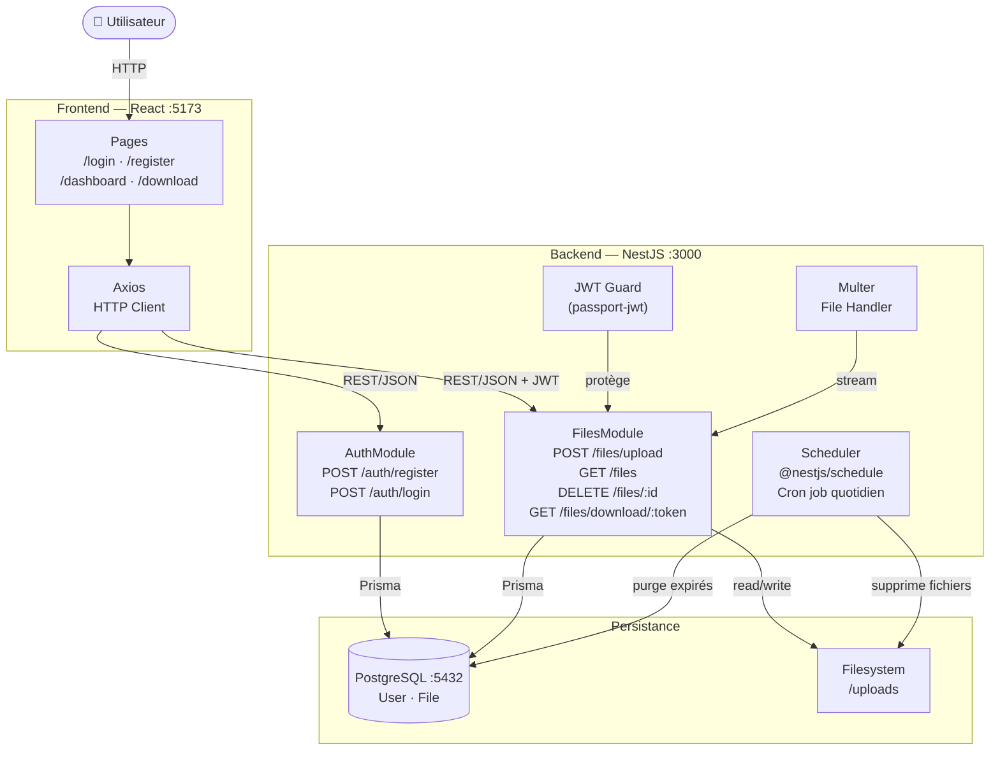

# Architecture — DataShare

```mermaid
graph TD
    User(["👤 Utilisateur"])

    subgraph Frontend ["Frontend — React :5173"]
        Pages["Pages\n/login · /register\n/dashboard · /download"]
        Axios["Axios\nHTTP Client"]
    end

    subgraph Backend ["Backend — NestJS :3000"]
        AuthModule["AuthModule\nPOST /auth/register\nPOST /auth/login"]
        FilesModule["FilesModule\nPOST /files/upload\nGET /files\nDELETE /files/:id\nGET /files/download/:token"]
        JWT["JWT Guard\n(passport-jwt)"]
        Multer["Multer\nFile Handler"]
        Cron["Scheduler\n@nestjs/schedule\nCron job quotidien"]
    end

    subgraph Data ["Persistance"]
        PostgreSQL[("PostgreSQL :5432\nUser · File")]
        Filesystem["Filesystem\n/uploads"]
    end

    User -->|"HTTP"| Pages
    Pages --> Axios
    Axios -->|"REST/JSON"| AuthModule
    Axios -->|"REST/JSON + JWT"| FilesModule
    JWT -->|"protège"| FilesModule
    AuthModule -->|"Prisma"| PostgreSQL
    FilesModule -->|"Prisma"| PostgreSQL
    FilesModule -->|"read/write"| Filesystem
    Multer -->|"stream"| FilesModule
    Cron -->|"purge expirés"| PostgreSQL
    Cron -->|"supprime fichiers"| Filesystem
```